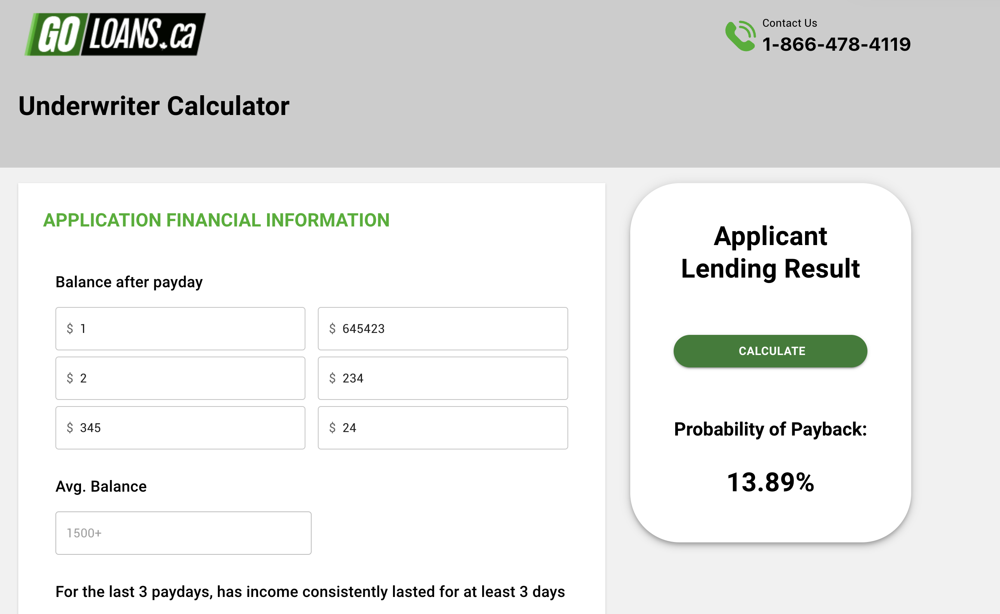

# GoLoansCA - TypeScript/MaterialUI Lending Underwriter Calculator

The goal of this app is to calculate the probability of payback from customers.

This project was bootstrapped with [Create React App](https://github.com/facebook/create-react-app).

## Author

Anthony COLAS

## Technologies

- 
- 

## Preview

## Installation

### Prerequisites

- npm
- yarn

### How to install?

#### Install

Go inside the installed repository and install dependencies:
`yarn`
`npm install`

Launch
`yarn start`
`npm start`

#### Accessing the website

Frontend is now rendered at URL `http://localhost:3000`

#### Technology

TypeScript, Material UI and Netlify were heavily used for this project.